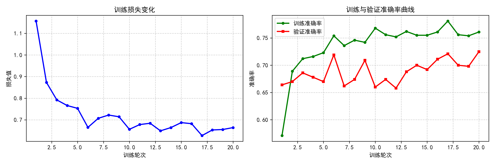

# Rubbish_Classification

垃圾图像分类系统 - 基于MobileNetV2的六类垃圾分类模型

## 项目简介

本项目实现了对生活垃圾的图像分类，采用MobileNetV2预训练模型进行迁移学习，可识别6类垃圾：纸板(cardboard)、玻璃(glass)、金属(metal)、纸张(paper)、塑料(plastic)和其他垃圾(trash)。

## 数据集

- **数据来源**: `Garbage classification` 文件夹
- **类别数量**: 6类
- **数据划分**: 训练集 80%，验证集 20%

| 类别 | 英文名 |
|------|--------|
| 纸板 | cardboard |
| 玻璃 | glass |
| 金属 | metal |
| 纸张 | paper |
| 塑料 | plastic |
| 其他垃圾 | trash |

## 模型架构

- **主干网络**: MobileNetV2 (ImageNet预训练)
- **输入尺寸**: 128×128
- **分类头**: 6类输出
- **训练策略**: 冻结主干网络，仅训练分类头

## 训练配置

```python
epochs = 20
batch_size = 16
learning_rate = 0.001
优化器 = Adam
损失函数 = CrossEntropyLoss
```

## 训练结果

- **最佳验证准确率**: 72.5%
- **训练准确率**: 76.1%
- **训练轮次**: 20 epochs

训练损失和准确率曲线:



## 文件说明

```
Rubbish_Classification/
├── train.py          # 训练代码
├── predict.py       # 预测代码
├── plot_curves.py   # 绘制训练曲线
├── best_model.pth  # 训练好的模型权重
└── Garbage classification/
    ├── cardboard/  # 纸板样本
    ├── glass/      # 玻璃样本
    ├── metal/      # 金属样本
    ├── paper/     # 纸张样本
    ├── plastic/   # 塑料样本
    └── trash/     # 其他垃圾样本
```

## 使用方法

### 训练模型
```bash
python train.py
```

### 预测图片
```bash
python predict.py
```
需要修改 `predict.py` 中的 `img_path` 为你的测试图片路径。

### 绘制训练曲线
```bash
python plot_curves.py
```

## 环境依赖

```
torch
torchvision
Pillow
matplotlib
```

## 总结

本项目通过迁移学习使用MobileNetV2实现了垃圾分类功能，在验证集上达到了72.5%的准确率。模型采用轻量级网络设计，可在CPU上快速运行，适合实际应用场景。